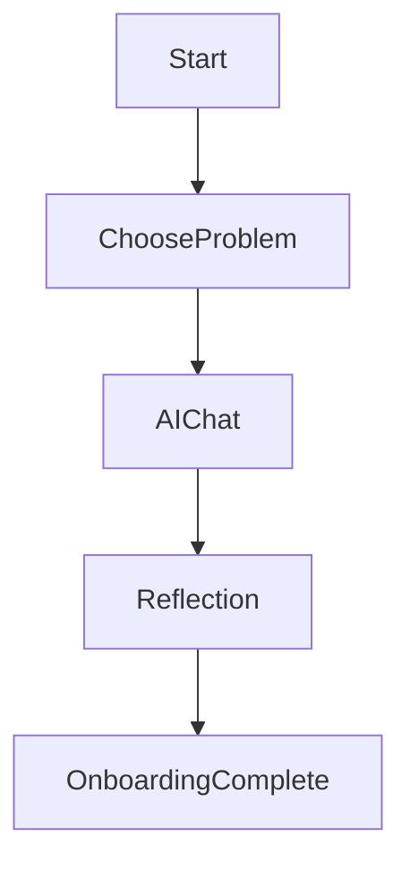
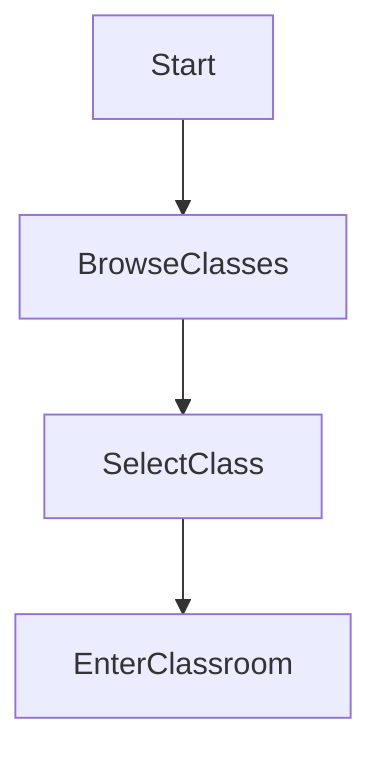
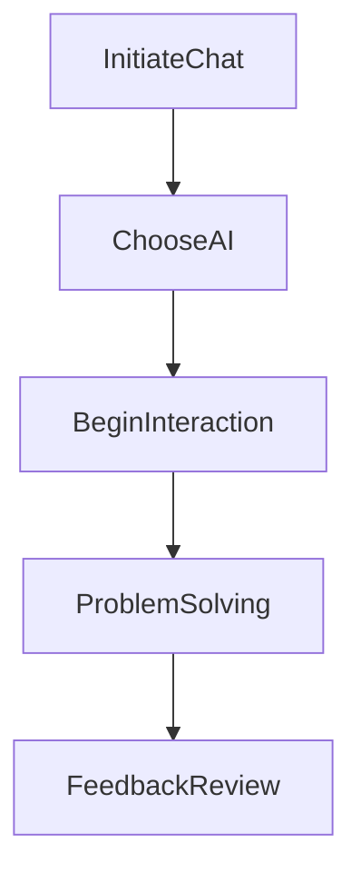
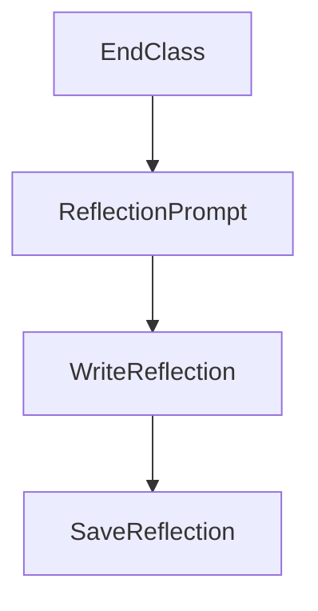
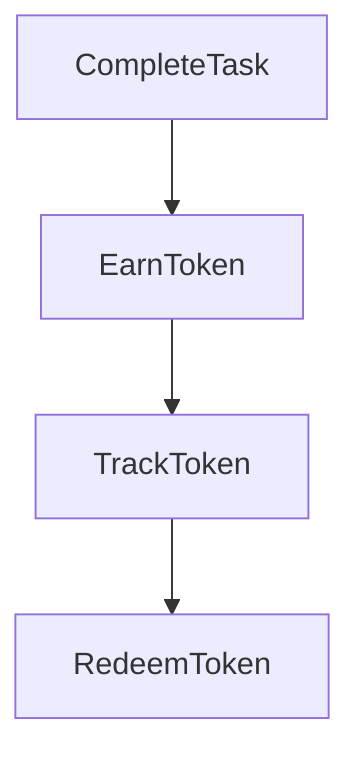
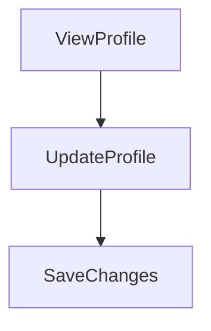
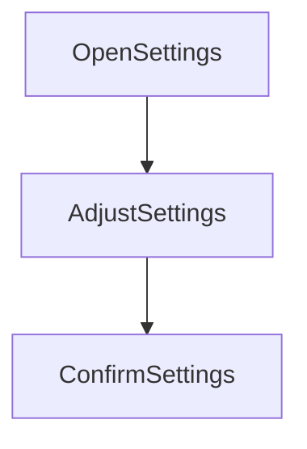
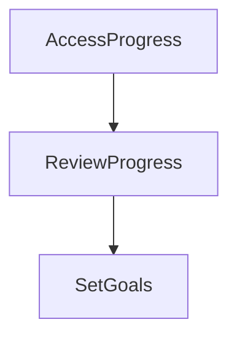

# UX Flows

## Primary User Journeys

### Onboarding

- **Choose Problem:** User selects a problem to work on.
- **AI Chat:** User interacts with AI personalities to solve the chosen problem.
- **Reflection:** User reviews feedback and personal growth.

### Class Selection

- **Browse Classes:** User explores available classes.
- **Select Class:** User selects a class they wish to participate in.
- **Enter Classroom:** User enters the virtual classroom.

### AI Chat

- **Choose AI:** User selects an AI personality for interaction.
- **Begin Interaction:** Conversation with AI starts.
- **Problem Solving:** User and AI work on a problem.
- **Feedback Review:** User receives AI feedback.

### Reflection

- **Reflection Prompt:** User is prompted to reflect post-class.
- **Write Reflection:** User writes their thoughts and learning.
- **Save Reflection:** Reflection is saved to user profile.

### Skill Tokens

- **Earn Token:** User earns a token upon task completion.
- **Track Token:** Token is recorded in user account.
- **Redeem Token:** Token can be redeemed for rewards.

## Secondary User Journeys

### Profile

- **View Profile:** User accesses their individual profile.
- **Update Profile:** User makes changes to their profile.
- **Save Changes:** Applied changes are saved.

### Settings

- **Open Settings:** User navigates to settings.
- **Adjust Settings:** User adjusts various settings (e.g., notifications, privacy).
- **Confirm Settings:** Changes are confirmed and updated.

### Progress Review

- **Access Progress:** User accesses their progress dashboard.
- **Review Progress:** User reviews historical performance.
- **Set Goals:** User sets future learning goals.

## Edge Cases

1. **Empty State:** Display message when no data is available.
2. **Error State:** Provide specific error messages for various issues.
3. **Timeouts:** Handle timeouts gracefully with retry options.
4. **Network Failures:** Inform user and retry when network fails.
5. **Invalid Inputs:** Validate inputs and provide corrective suggestions.
6. **Unresponsive AI:** Restart AI chat on technical issues.
7. **Token Redemption Errors:** Alert user if token cannot be redeemed.
8. **Class Unavailable:** Show alternative classes if selected is not available.
9. **Profile Save Error:** Inform user of issues while updating profiles.
10. **Settings Not Saved:** Retry mechanism for unsaved settings due to error.
11. **Progress Dashboard Load Issue:** Suggest retrying load.
12. **Incorrect AI Feedback:** Allow user to report incorrect feedback.
13. **Reflection Not Saved:** Notify user with options to retry or download.
14. **Unrecognized Class Completion:** Verify completion and notify user.
15. **Session Expiration:** Warn user before auto log-out due to inactivity.

## Validation Rules

- **Onboarding:** Must complete all stages.
- **Class Selection:** Ensure class availability.
- **AI Chat:** Validate contextual relevance of feedback.
- **Reflection:** Ensure reflection is saved before navigation.
- **Skill Tokens:** Validate redemption upon token accomplishment.

## Mapping to PRD Acceptance Criteria

- **Onboarding Completion:** Aligns with acceptance criteria 1.
- **Six Practice Classes:** Maps to acceptance criteria 2.
- **AI Personalities:** Targeted in acceptance criteria 3.
- **Skill Tokens:** Inclusion fulfills acceptance criteria 4.
- **Contextual Feedback:** Ensures compliance with acceptance criteria 5.
- **Reflection Review:** Contributes to acceptance criteria 6.
- **Responsive Features:** Ensures web and mobile functionality, aligning with acceptance criteria 7.
- **Version Control:** Supported, aids in acceptance criteria 8.
- **Documentation:** Automated for every release, enhancing acceptance criteria 9.
- **Progress Save and Resume:** Ensures acceptance criteria 10 is completed.
